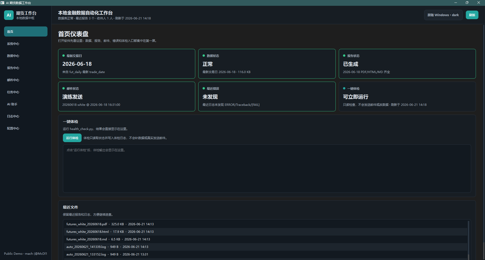
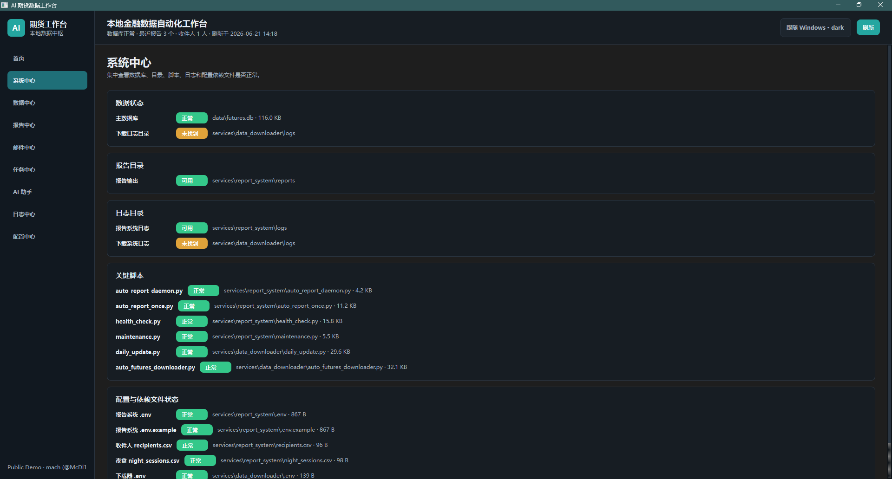
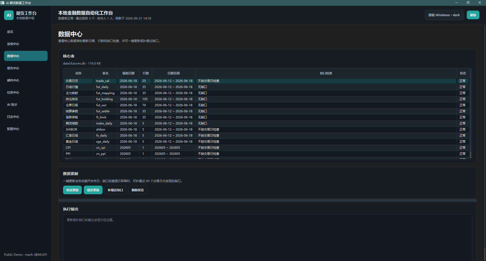
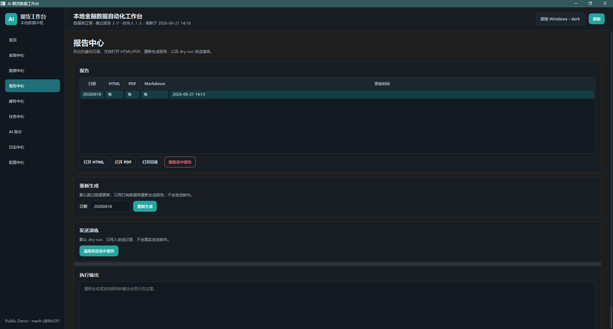
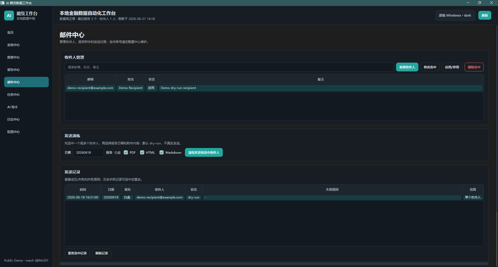
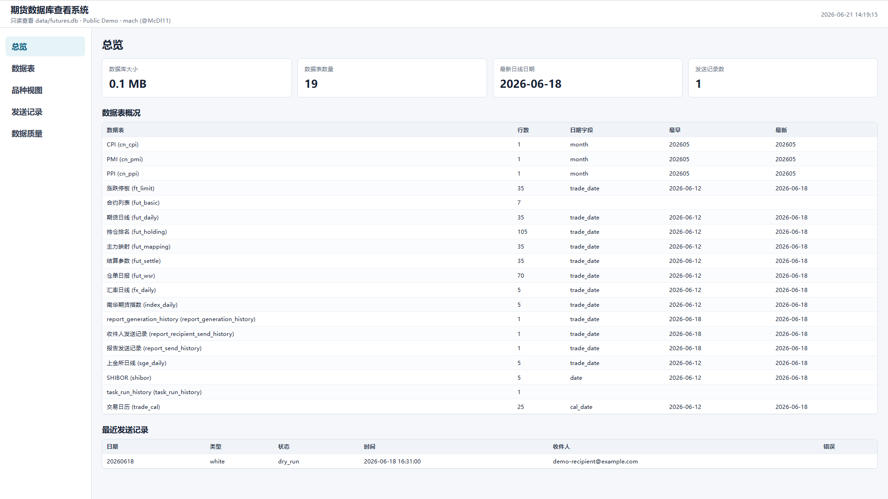
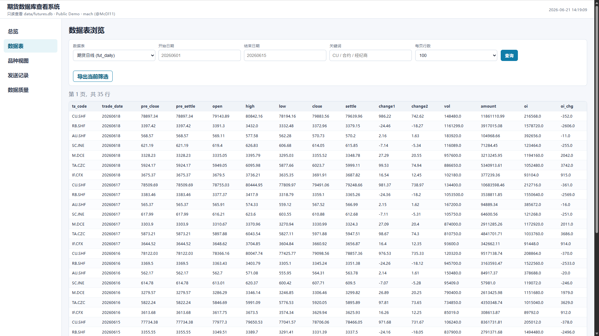
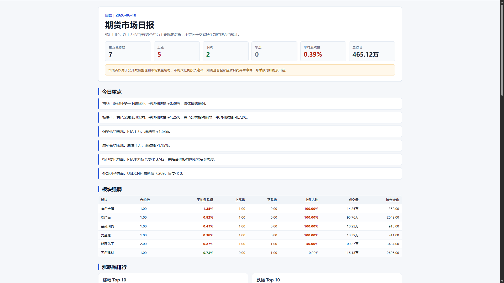

# 本地金融数据运营工作台 Demo

语言: [English](README.md) | 中文说明

这是一个本地金融数据运营工作台 Demo，覆盖数据检查、日报生成、邮件发送演练、数据库查看、任务管理和日志排查等流程。

本仓库是公开演示版本，适合用于作品集展示、技术面试、项目沟通和早期商业验证。Demo 使用小型模拟 SQLite 数据库，不包含真实账号、真实客户名单、生产行情库或任何私密凭证。

作者: mach ([@McDl11](https://github.com/McDl11))

## 项目截图

### 桌面工作台首页



### 系统中心



### 数据中心



### 报告中心



### 邮件中心



### 数据库查看系统



### 数据表浏览



### 自动生成的日报



## 这个项目解决什么问题

期货数据相关工作经常分散在多个脚本、数据库文件、表格和邮件流程里。这个 Demo 把常见操作集中到一个本地工作台中：

- 检查本地数据库是否正常、核心表是否缺数据
- 生成期货市场日报，支持 HTML、Markdown、PDF
- 管理报告发送流程，并默认使用 dry-run 演练，避免误发真实邮件
- 查看发送记录、任务记录和日志
- 用只读网页查看 SQLite 数据库，方便排查和展示
- 保留本地优先的工作方式，不依赖云端后台

## 核心功能

- 桌面工作台: 使用 Python + PySide6 构建，集中管理数据、报告、邮件、任务、日志和配置。
- 数据中心: 查看核心表日期、行数、缺口检查结果，并支持快速更新、稳妥更新和最近缺口补齐。
- 报告中心: 基于本地数据库生成期货市场日报，支持打开 HTML/PDF/目录。
- 邮件中心: 管理收件人、选择附件格式、查看发送记录。公开版默认 dry-run，不会真实发送邮件。
- 任务中心: 运行体检、报告演练、维护脚本，并查看 24 小时守护任务状态。
- 日志中心: 集中查看最近日志和错误日志，方便定位失败原因。
- 数据库查看系统: 只读浏览 `data/futures.db`，支持总览、数据表、品种视图、发送记录和数据质量检查。
- AI 助手: 以只读方式解释任务、报告、邮件和日志状态，适合后续扩展为运维助手。

## Demo 运行方式

先安装依赖并生成本地 Demo 配置：

```powershell
setup_demo.bat
```

启动桌面工作台：

```powershell
start_demo.bat
```

生成 Demo 报告：

```powershell
generate_demo_report.bat
```

打开只读数据库查看系统：

```powershell
open_database_viewer.bat
```

数据库查看系统默认地址：

```text
http://127.0.0.1:8765
```

## 手动命令

如果不使用 `.bat` 文件，也可以在 PowerShell 中手动运行：

```powershell
python -m venv .venv
.\.venv\Scripts\Activate.ps1
pip install -r requirements.txt
python scripts\create_demo_data.py
copy services\report_system\.env.example services\report_system\.env
copy services\data_downloader\.env.example services\data_downloader\.env
copy services\report_system\recipients.example.csv services\report_system\recipients.csv
python run_desktop.py
```

手动生成报告：

```powershell
python services\report_system\auto_report_once.py --report-type white --date 20260618 --no-update --force
```

运行体检：

```powershell
python run_health_check.py
```

## 技术栈

- Python
- PySide6
- SQLite
- Pandas
- 本地 HTTP 数据库查看器
- HTML / Markdown / PDF 报告生成
- PowerShell / Windows 批处理启动脚本
- unittest 自动化测试

## 目录结构

```text
apps/
  desktop/              桌面工作台
  db_viewer/            只读 SQLite 数据库查看系统

services/
  report_system/        报告生成、邮件演练、体检、维护脚本
  data_downloader/      数据下载与导入模块

scripts/
  create_demo_data.py   Demo 模拟数据库生成脚本

data/
  futures.db            公开 Demo 用小型 SQLite 数据库

docs/
  screenshots/          README 展示截图

tests/                  安全和流程测试
```

## 公开版不包含什么

为了避免泄露隐私和生产资料，公开 Demo 不包含：

- 真实 `.env` 配置文件
- Tushare Token、DeepSeek Key、PushPlus Token、SMTP 授权码等真实密钥
- 真实收件人或客户名单
- 生产期货数据库
- 大体量行情 CSV 文件
- 运行日志
- 自动生成的报告成品
- 数据库备份
- 本地虚拟环境
- Python 缓存文件
- 内部商业规划或私人笔记

## 安全说明

- 邮件发送默认是 dry-run，只记录演练结果，不真实发送。
- Demo 数据是模拟数据，不能用于交易决策。
- 本项目不提供投资建议。
- 真实密钥只能保存在本地 `.env` 文件中，不应提交到 Git。
- 桌面界面、数据库查看系统和报告中保留了作者标识: `mach (@McDl11)`。

## 适合怎么展示

这个项目更适合定位为“本地金融数据运营工作台”，而不是“预测交易系统”。它展示的是数据工程、自动化报告、桌面工具、运维排查和安全发布能力。

可以用于展示：

- 本地数据产品设计能力
- Python 桌面应用开发能力
- SQLite 数据建模和检查能力
- 报告自动化和邮件流程设计能力
- Demo 安全处理和公开发布意识
- 面向实际业务流程的工程整理能力

## 后续商业化方向

如果后续要继续打磨，可以考虑：

- 为研究员或运营团队定制日报模板
- 接入不同数据源
- 增加定时任务和发送审计
- 增加更多数据质量规则
- 增加团队配置和权限边界
- 做成可安装版本或内部部署版本

## 许可证

Copyright (c) 2026 mach (@McDl11). All rights reserved.

本公开 Demo 仅用于作品展示和技术演示。未经作者许可，不允许商业使用、二次分发、转售或发布修改版本。
